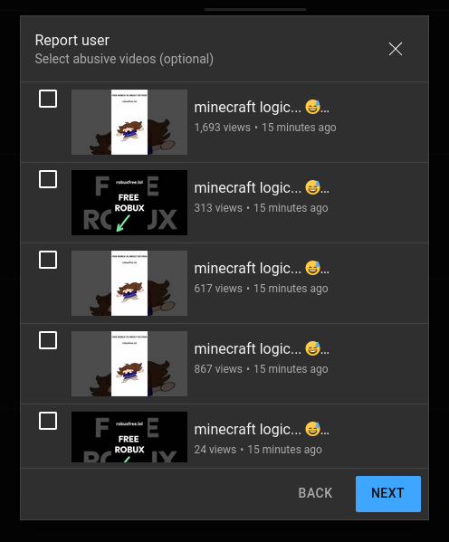

YouTube Report All User's Videos
================================
If you've ever been scrolling through YouTube shorts, you're probably familiar with videos calling you to go to a user's profile and click a link in their about page for free things such as robux. If you've ever tried reporting these types of users, you've probably seen this screen asking you to select abusive videos.

Typically with these users, you'd want to select *all* of their videos, because they typically mass upload these kinds of videos to boost their chances of being shown to users. This extension allows you to select all of a user's videos with one click.

Now you can report these kinds of users with ease. If only YouTube would actually care. :(

Installing & Using
------------------
This is how you can install and use this userscript.

### Requirements
- Tampermonkey or Greasemonkey

### Installation
1. Open Tampermonkey or Greasemonkey's dfashboard
2. Go to Installed Userscripts
3. Download index.js
4. Drag and drop index.js into the dashboard
5. Ensure the Userscript is enabled

### Using
1. Go to a user's about me
2. Click the report button
3. Continue to the select abusive videos screen
4. Click on the Tampermonkey/Greasemonkey icon
5. Click the "Add The Button I'm Too Lazy To Do It For You" button below the Userscript's name
6. Click the "Select All" button 👍
